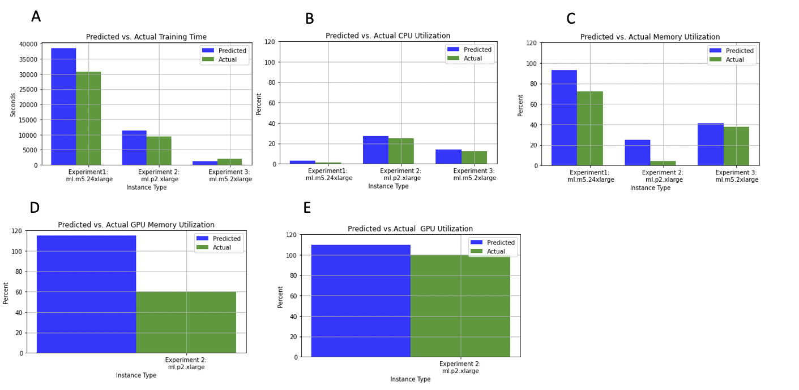
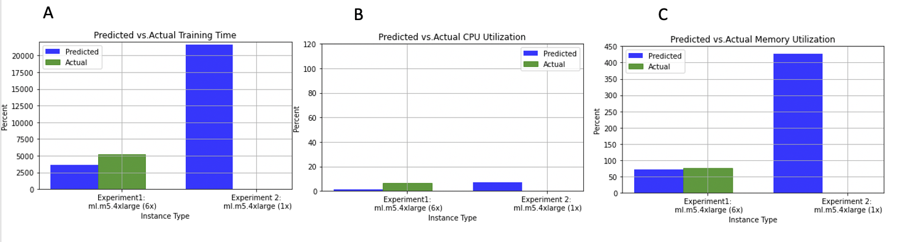

# Benchmarking Results

**Disclaimer** 

These benchmarking results are based on limited testing, and may not be representative of workloads you are working on. We show them merely to demonstrate what we found when using this library in the datasets we tested. **Your mileage will vary depending on your algorithms, data, and a host of other factors!**

Please note that if you are re-running the sample notebooks that correspond to these experiments, you may get variance due to the stochasticity of the canary training library. For example, forecasted training time for experiment 1 sometimes was as high as 40,000 seconds, and sometimes as low as 23,000 seconds.

## Experiments 1-3: Single Instance Training

In order to test the canary training approach, we first performed 3 experiments using single instance training.

**Experiment 1** is a regression task using the [built-in SageMaker XGBoost algorithm](https://docs.aws.amazon.com/sagemaker/latest/dg/xgboost.html) to predict total taxi fare for a trip using New York City taxi data (the data was downloaded from [here]( http://s3//nyc-tlc/trip/data/) and originally comes from the Registry of Open Data on AWS [here](https://registry.opendata.aws/nyc-tlc-trip-records-pds/)). This data set is 40GB after preprocessing; comprising of 7 columns and 1,465,356,670 rows. There are a total of 132 files, most files were 350-400 MB, but some were in the 10s of MBs. The instance type used for training was a ml.m5.24xlarge. The processed data is located at this S3 URI: `s3://aws-hcls-ml/public_assets_support_materials/canary_training_data/taxi_yellow_trip_data_processed/`. The notebook `2_canary_training_example_taxi_data.ipynb` corresponds to this experiment.

**Experiment 2** follows a [blog post](https://aws.amazon.com/blogs/machine-learning/fine-tuning-a-pytorch-bert-model-and-deploying-it-with-amazon-elastic-inference-on-amazon-sagemaker/) and associated Github resources to refine a BERT model using a custom script with Pytorch. The [associated dataset](https://nyu-mll.github.io/CoLA/) is 3 MB; which we partitioned to 200 csv files. The instance type used for training was a ml.p2.xlarge. The processed data is located at this S3 URI: `s3://aws-hcls-ml/public_assets_support_materials/canary_training_data/cola_data/train_dir/`. The directory `3_bert_fine_tuning_canary_train_example` corresponds to this experiment.

**Experiment 3** uses a synthetic dataset that has 10 GB of data. This dataset had 20 columns, and the dataset was partitioned into 100 files each 100 MB. The SageMaker built-in XGBoost regressor was used on this data. The instance type for this experiment was an ml.m5.2xlarge.The processed data is located at this: S3 URI `s3://aws-hcls-ml/public_assets_support_materials/canary_training_data/10_gb_20_cols/`. `0_quick_start_canary_training_example_synthetic_data.ipynb` 

For each of the experiments, we performed 9 canary training jobs in total; using 1%, 2%, and 3% of the data, with each percentage being in triplicate. Thus, there were three canary training jobs that use 1% of the data, 3 jobs that use 2% of the data, and 3 that use 3% of the data. We perform these in triplicate to increase statistical robustness due to the fact that there is stochasticity in resource consumption for any given training job. While the information from even more training jobs would undoubtedly be useful, the value of this approach diminishes  with each additional job.

The results of these are shown below.

 **FIGURE 1** Predicted (blue) vs. Actual (green) resource consumption is shown for three separate experiments. The X axis is the experiment (Experiment 1, Experiment 2, and Experiment 3) and corresponding instance type the experiment was performed on. The Y axis is the amount of resources consumed (training seconds for training time and percentage for CPU/RAM/GPU). Note that “Actual CPU Utilization“, “Actual Memory Utilization“, “Actual GPU Utilization“ and “Actual GPU Memory Utilization“ is defined as the p99 metric. Note that for GPU and GPU memory utilization, only one experiment is shown, due to the fact that only Experiment 2 utilized a GPU-backed instance. The data used to generate these and other graphs can be found in the appendix.*

Overall, predicted resource consumption was at least within an order of magnitude of true consumption use. Figure 2A shows that the predicted training time for Experiment 1 (38454 seconds) was 25.0% larger than the true training time (30770). The worst forecast (fig. 1C) was for memory consumption for Experiment 2, where the predicted RAM consumption (24.7%) was more than 6 times greater than the true value of 3.99%.

# Experiment 4: Parallel Training

Many use cases for long training jobs rely on distributed training across multiple instances. In order to test whether canary training could be used in the context of distributed training using data parallelism, we repeated Experiment 1 above, but compared the results of the ml.m5.24xlarge to a data distributed training job that takes advantage of 6 ml.m5.4xlarge. Note that 6 ml.m5.4xlarge instances together have the **same number of CPU and amount of RAM** as a single ml.m5.24xlarge (96 vCPU and 384 GB RAM). Thus, this experiment is meant to mimic a typical machine learning training use-case where the data scientist knows that their dataset requires a large amount of RAM and is unsure of whether they should leverage distributed training or single instance training. For this experiment , we used the [ShardedbyS3Key](https://docs.aws.amazon.com/sagemaker/latest/APIReference/API_S3DataSource.html) parameter in the SageMaker Estimator.

As in the first set of experiments, the canary training was performed on a maximum of 3% of the partitions, which for this dataset corresponded to 4 partitions (.03 × 132 = 3.96). Because 4 files cannot be evenly distributed across 6 instances, we instead perform the canary training on a single ml.m5.4xlarge instance, and then divide all of the resulting forecasts by 6. The result of this experiment is shown below.

 **FIGURE 2** These graphs show predicted (blue) vs. actual (green) resource consumption for a distributed training experiment. Experiment 1 is distributed over 6 ml.m5.4xlarge, their prediction results are simply the result of dividing the results of Experiment 2 (1x ml.m5.4xlarge) by 6. For Experiment 1, no green bars are shown, since the training job failed with an out-of-memory error.*

The results of this experiment are that overall, resource consumption prediction is within an order of magnitude of the true values. For example, training time for the distributed job (Figure 3A) (3609) has an error of 30.27% compared to the true value (5176). Memory usage is predicted more accurately, with the predicted value of 71.013 having an error of only 7.14% compared to 76.47. Some of these inaccuracies may be a result of loss of linear scaling when [training data parallel models]( https://docs.aws.amazon.com/sagemaker/latest/dg/data- parallel.html).

We also compared the predicted vs. actual results for training this model on a single ml.m5.4xlarge instance. Although the canary training finished successfully, one key result was that the predicted memory usage was a memory usage of 426% on the single instance, as shown in the blue bar of the figure. This would be expected to result in an out of memory error; an out-of-memory error did in fact result when trying to train on the entire dataset using a single ml.m5.4xlarge.

Finally we explored whether canary training can be used to determine whether distributed or single instance training are more cost effective in this use case (The costs shown are using the eu-west-1 (Dublin) region). This is shown in the following table:

| Instance Type      | Predicted training time (s) | Actual training time (s) | Predicted cost (USD)| Actual Cost (USD)|
| ----------- | ----------- | ----------- |----------- |----------- |
| 6x ml.m5.4xlarge       | 3609|5176|5.55|7.95|
| 1x ml.m5.24xlarge     | 38454|30770|59.07|47.25|

As shown in this table, canary training correctly forecasts that 6 ml.m5.4xlarge instances will lead to faster training time and decreased costs compared to 1 ml.m5.24xlarge

# Conclusion and Caution

These results may or not be representative of your own work and do not guarantee that you will achieve similair performance.

