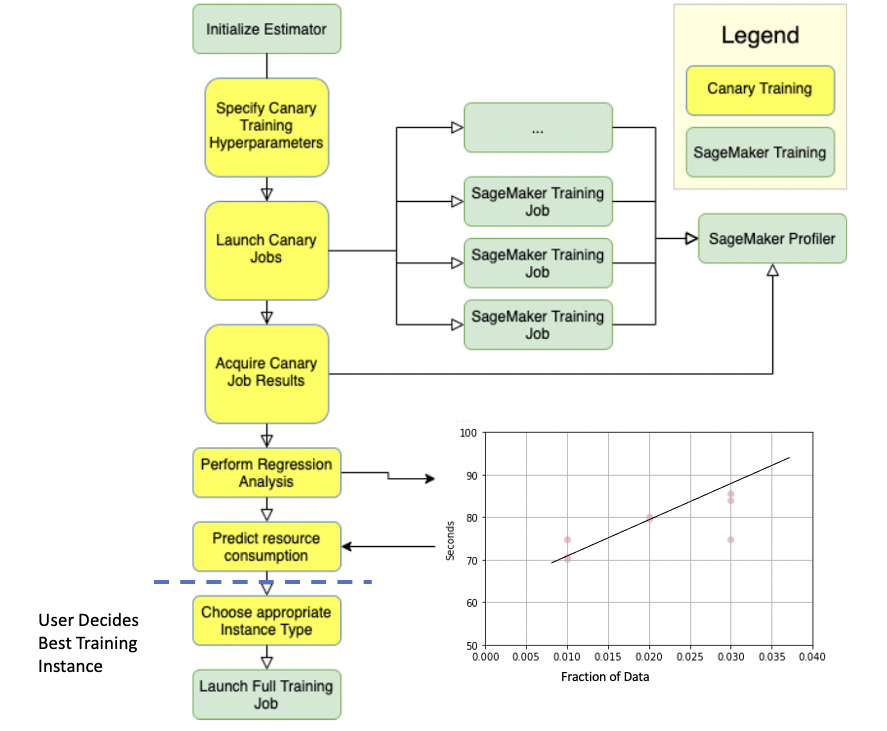

# Predict SageMaker Training Resource Consumption using Canary Training to enable Data-Driven Selection of Training Instances

Model training often requires disparate amounts of training resources. [Amazon SageMaker](https://aws.amazon.com/pm/sagemaker) provides a large number of choices in compute hardware resources available to users, include many different types of GPU and CPU based training instances. However, knowing the resource requirements of the training job in advance can be challenging. For example, Data Scientists may ask the following questions:

* Which training instance will work for my training job?
* How much CPU/RAM/GPU resources does my training job require?
* How long will it take for the training to finish? How much will it cost?
* Should I use a single instance or [distributed training](https://docs.aws.amazon.com/sagemaker/latest/dg/distributed-training.html)?

The `canary_training` library allows Amazon SageMaker users to forecaset RAM/CPU/GPU RAM/GPU and training time for SageMaker single instance training jobs. We refer to these five metrics in aggregate as `Consumed resources`. This information in turn can be used by data scientists to suggest whether a specific instance type will work for an ML job, or if perhaps a different instance is needed. 

This repository explores how to use the `canary training` library to predict SageMaker resource consumption (CPU usage, RAM, Training Time, GPU Usage, and GPU memory) for  large training jobs. Please note this library is  in beta and  **we may introduce breaking changes in the future**.

`canary training` works by creating many small training jobs on small percentages of the data (generally, 1,2 and 3 percent). Based on the statistics gathered (using the [SageMaker Profiler](https://docs.aws.amazon.com/sagemaker/latest/dg/debugger-profiling-report.html)) it then **extrapolates** the resource consumption for the complete training job.

## Installation and Use

You can install the library directly from github using pip `pip`:

???

`pip install git+https://git-codecommit.us-east-1.amazonaws.com/v1/repos/canary_training.git#subdirectory=Canary_Training/canary_training`

You can see a basic example of how to use the canary training library in the notebook `Canary_Training/quick_start_example_notebooks/0_quick_start_canary_training_example_synthetic_data.ipynb`.

This repository contains some example Jupyter notebooks for using the `canary_training` library; please see those examples for more information.  If you are running the sample notebooks included in this repository, you can also clone this repository, and the sample notebooks will install the library as well when you run them. We have tested the library on SageMaker Studio and SageMaker Notebook Instances.

After leveraging canary training, the data scientist can inspect two sets of values:

1. Forecast resource consumption for the training instance(s) selected. This will look something like this:

| Instance Type      | Projected_CPUUtilization | Projected_MemoryUsedPercent | Projected_TrainingTimeInSeconds| Projected_GPUUtilization)|Projected_GPUMemoryUtilization|price|Projected_TotalCost
| ----------- | ----------- | ----------- |----------- |----------- |----------- |----------- |----------- |
| ml.p2.xlarge	      | 27.5|5.159929|21504.810337|110.0|59.401159|0.0003125|6.72025|

2. Raw resource consumption data for for the training instance(s) selected for all the training jobs. The first row will look like something like this:

| TrainingJobStatus    | TrainingTimeInSeconds | InstanceType| ManifestLocation| job_name|PercentageDataTrainedOn|CPUUtilization|OWaitPercentage|MemoryUsedPercent|GPUUtilization|GPUMemoryUtilization
| ----------- | ----------- | ----------- |----------- |----------- |----------- |----------- |----------- |----------- |----------- |----------- |
| Completed      | 348|ml.p2.xlarge	|5.s3://...|canary_training...|.01|26.0|100.0|4.72|100|55.0|

The raw resource consumption data can be used by data scientists for manual inspection of the underlying data, and can in principle be used for generating your own resource consumption forecast.

## How does the Canary Training library work?
The canary_training library works by creating smaller-scale training jobs, termed `Canary Training Jobs`, collects the job metrics using the [SageMaker Profiler](https://docs.aws.amazon.com/sagemaker/latest/dg/debugger-profiling-report.html) and performs **extrapolations to predict the Consumed Resources for the entire Training Job**. A schematic of this is shown below:

*The Canary Training approach is summarized in the above flowchart. Green shows Amazon SageMaker components; yellow shows `canary_training` library components.  The library works with the SageMaker Python SDK. It can launch smaller-scale training jobs, termed Canary Training Jobs, collect their metrics, perform regression, and extrapolate to predict the Consumed Resources for the entire Training Job. This enables users or builders to scale the instance-type horizontally or vertically as needed, given the predictions.*

## FAQ

**Is this library a SageMaker feature?**

No. This library is an open-source library that predicts SageMaker training resource consumption; it is not itself a feature of SageMaker.

**Will this library automatically tell me the best Training Instance for my job?**

No. This library will provide information and forecasts of resource consumption fo the training instance(s) you choose to test for training. Data Scientists can use this information to make data-driven decisions about what training instance(s) is best for their use case.  

**What do I need to get started with this library?**

The major assumptions are:
 1. Your data is stored in S3
 2. Your data is partitioned into at least 10 partitions; we recommend at least 100 partitions.
 3. You are using a SageMaker Estimator.

In addition, in order for forecasts to be a accurate, the library assumes **approximate** `O(n)` computational complexity, where n is the number of datapoints. If your algorithm has significant deviations from this, you can still leverage `canary_training` to derive compute resources for the canary_training jobs, but you may not want to rely exclusivley on the forecast values. 

**Can you use this library for predicting SageMaker distributed training resource consumption?**

No; at least not directly. We have not tested the `canary_training` library in the context of SageMaker's [distributed training libraries](https://docs.aws.amazon.com/sagemaker/latest/dg/distributed-training.html) for either [data parallel](https://docs.aws.amazon.com/sagemaker/latest/dg/data-parallel.html) or [model parallel](https://docs.aws.amazon.com/sagemaker/latest/dg/model-parallel-intro.html) training. 

However, we have done one experiment which indicated that using canary training for a single instance can be used to predict resource consumption for SageMaker  [parallelized data distribution](https://sagemaker-workshop.com/builtin/parallelized.html) training jobs using the [ShardedByS3Key parameter](https://docs.aws.amazon.com/sagemaker/latest/APIReference/API_S3DataSource.html), parameter. Please see Experiment 4 in the document `Canary_Training/benchmarking_information/benchmarking_data.md` for an example of this. While single instance canary training jobs *may* shed light on resource consumption for model or data parallel distributed training, we have not verified this.

**Has this library been benchmarked? How well does this approach perform?**

We have tested this library using the SageMaker built-in XGboost algorithm and a custom script for training BERT; see `Canary_Training/benchmarking_information/benchmarking_data.md` for more information.  However, we have not exhaustivley tested this library, and your results may differ very much from ours, depending on your data, algorithm, and many other factors.

**Do you provide guarantees for how well this library forecasts training times and other resource usage?**

No. We cannot not provide any guarantees for the performance of the library.

**Where can I run this library?**

We have confirmed that the canary training libary works in SageMaker Studio and SageMaker Notebook Instances.

**Will using canary training cost money?**

Yes. Because canary training launches SageMaker Training jobs, you will be billed for the time those training jobs last. It is recommended that you configure the partitions of the data or the percentage of data being leveraged in the canary training jobs to avoid excessive cost.

**Is this library related to the SageMaker Inference Recommender?**

No. The [Inference Recommencer](https://aws.amazon.com/about-aws/whats-new/2021/12/amazon-sagemaker-inference-recommender/) is a SageMaker built-in feature for selecting the best available compute instance for **deploying** SageMaker models. The `canary_training` library is an open-source library for  forecasting compute resources for SageMaker **Training** jobs; and in turn enables data scientists select an optimal training instance.

**How do I use this library, what are the major points to keep in mind? What are the assumptions?**

You can see a basic example of how to use the canary training library in the notebook `Canary_Training/quick_start_example_notebooks/0_quick_start_canary_training_example_synthetic_data.ipynb`.

In our testing, the most important parameter to control for was the `training_percentages`, which controls the percentage of data for the container training jobs. What percentage of the training data you perform canary training and how many times it is done is very important. Training on too little data may cause forecasts to be inaccurate, while training on too much is not cost effective. The example in the notebooks use 1%,2% and 3% of the data in triplicate; but please bear in mind that this may be too much or too little for your use case.

Furthermore, the `canary_training` library assumes that you have split your data into a seperate partitions on S3. We recommend at least 100 partitions to leverage canary training, for example, splitting your csv data into 100 smaller csvs. The canary_training library will **not** work if your training data is a single S3 object.

**When Should I NOT use this library?**

If you have a dataset that is fairly small or a training algorithm that is simple, and training is not anticipated to take very long (~ minutes or a few hours) then running canary training may be less efficient that simply running training on a large SageMaker Training instance. **Furthermore the canary_training library will not work if your training data is not partitioned or is partitioned into less than 10 partitions.**

**Why did you call this library "canary" training?**
The term "canary training" is an allusion to [canary deployment](https://wa.aws.amazon.com/wellarchitected/2020-07-02T19-33-23/wat.concept.canary-deployment.en.html).

**I have other questions, comments, have a bug report or there is something else I want to communicate with the maintainer of the library.**

We appreciate your comments very much! The easiest way to communicate regarding anything about the library is to use the Github Issues tab. Please bear with us if open issues take longer than expected to address or are closed.

## Further Reading and Resources

[Identifying training bottlenecks and system resource under-utilization with Amazon SageMaker Debugger](https://aws.amazon.com/blogs/machine-learning/identifying-training-bottlenecks-and-system-resource-under-utilization-with-amazon-sagemaker-debugger/)

[A Resource Utilization Prediction Model for Cloud Data Centers Using Evolutionary Algorithms and Machine Learning Techniques](https://www.mdpi.com/2076-3417/12/4/2160)

[On the Use of Machine Learning to Predict the Time and Resources Consumed by Applications](https://ieeexplore.ieee.org/document/5493447)

[Predictive performance modeling for distributed batch processing using black box monitoring and machine learning](https://www.sciencedirect.com/science/article/abs/pii/S0306437918301765)

[Ernest: Efficient Performance Prediction for Large-Scale Advanced Analytics](https://www.usenix.org/conference/nsdi16/technical-sessions/presentation/venkataraman)

[A multi-objective perspective on jointly tuning hardware and hyperparameters](https://arxiv.org/abs/2106.05680)

[Predicting the Computational Cost of Deep Learning Models](https://arxiv.org/abs/1811.11880)

## Security

See [CONTRIBUTING](CONTRIBUTING.md#security-issue-notifications) for more information.

## License

This project is licensed under the Apache-2.0 License.

